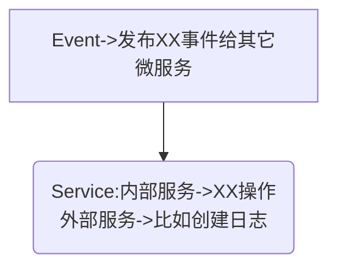

## 应用层

- 实现服务组合和编排，适应业务流程快速变化的需求。这一层聚集了应用服务和事件相关的功能

- 它主要存放应用层服务组合和编排相关的代码。应用服务向下基于微服务内的领域服务或外部微服务的应用服务完成服务的编排和组合，向上为用户接口层提供各种应用数据展现支持服务。应用服务和事件等代码会放在这一层目录里

* 领域事件其实放领域层也是可以的，放应用层主要是为了统一管理。如果领域事件放在实体内部，查找和运维起来就不是太方便，而且这个实体还需要对领域事件的实体进行操作。目录结构的设计主要是从边界、分层和便利性考虑的。

- 除了完成服务的组合和编排外，应用服务内还可以完成安全认证、权限校验、初步的数据校验和分布式事务控制等功能

- 为了实现微服务内聚合之间的解耦，聚合之间的服务调用和数据交互应通过应用服务来完成。原则上我们应该禁止聚合之间的领域服务直接调用和聚合之间的数据表关联

## 流程图

