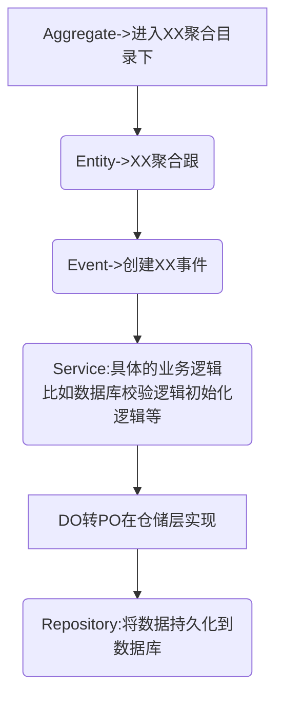

## 领域层

- 实现领域的核心业务逻辑。这一层聚集了领域模型的聚合、聚合根、实体、值对象、领域服务和事件等领域对象，以及它们组合所形成的业务能力

- 它主要存放领域层核心业务逻辑相关的代码。领域层可以包含多个聚合代码包，它们共同实现领域模型的核心业务逻辑。聚合以及聚合内的实体、方法、领域服务和事件等代码会放在这一层目录里

* 针对实体的维护，需要通过聚合去维护吗？可以直接修改实体吗？
* 聚合内的实体数据维护是通过聚合根通过仓储来统一维护的

- 一个聚合保存在一个库里，还是多个聚合都在一个库里？一个实体需要单独放一个库吗？如果一个实体被修改了。用到这个实体的聚合需要更新吗？
- 一个微服务一个库，微服务内的多个聚合可以共用一个库，但是尽量避免聚合之间的表关联，聚合之间的数据要做到松耦合

* Repository，放在领域层，如果一个对象出现在领域，多个领域对其进行操作，会不会太多重复的操作数据库？
* 聚合是具有一个完整业务功能的单位,一个聚合的功能在企业内应该是唯一的,而一个仓储只对应一个聚合，所以这个仓储应该不会共享给其它的领域模型，不会在基础层被其它的聚合复用的

- 应用服务只能调用领域服务和实体的方法，能调用仓储接口的方法么？
- 如果是应用服务直接调用文件或者缓存之类的，应用服务是可以之间调用仓储的。但如果中间有领域实体和数据库，则需通过领域服务，然后通过聚合根来调用仓储

## 流程图

