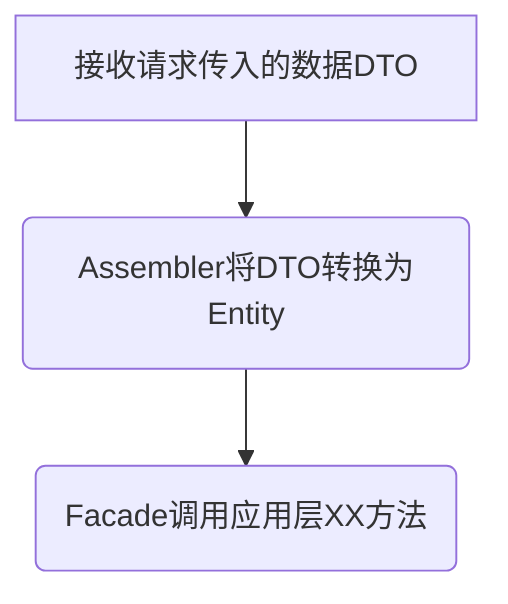

## 用户接口层
- 面向前端提供服务适配，面向资源层提供资源适配。这一层聚集了接口适配相关的功能

- 它主要存放用户接口层与前端交互、展现数据相关的代码。前端应用通过这一层的接口，向应用服务获取展现所需的数据。这一层主要用来处理用户发送的 Restful 请求，解析用户输入的配置文件，并将数据传递给 Application 层。数据的组装、数据传输格式以及 Facade 接口等代码都会放在这一层目录里

* 在用户接口层可以完成前端应用接口和数据适配，避免将接口和数据适配类需求传导到应用层；在应用层通过服务组合和编排，可以避免用例或服务组合类需求向领域层传导；在基础设施层通过依赖倒置设计，可以隔离技术组件变化对领域逻辑的影响
* 这样由外向里逐层消化和隔离外部变化对领域模型的影响，从而可以最大限度保持领域模型原子性和长期稳定

- 一个稳定的领域模型可以给我们带来非常多的好处
- 首先，领域模型的构建过程是项目团队通用语言建立的过程，领域模型就是团队的通用语言，它会贯穿项目的所有过程
- 其次，领域模型的业务逻辑大多是可复用的原子逻辑，不易受外部变化的影响。将这些核心逻辑沉淀到领域层，让核心逻辑更聚焦，核心代码更内聚。然后在应用层通过应用服务对领域层服务完成组合和编排，可以大量复用领域层的核心业务逻辑代码，从而提升代码复用率
- 第三，领域模型的核心代码可交由专门的资深开发人员维护，从而提升代码质量，也能够保证应用关键核心业务逻辑的长期稳定运行。
- 第四，领域模型内聚合边界更加清晰，可方便微服务以聚合为单位的功能和代码的拆分和重组，让微服务具有更强的演进能力。

## 流程图

